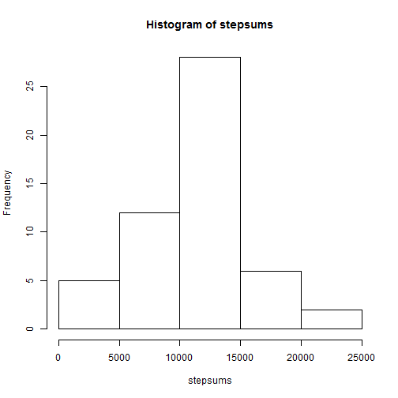
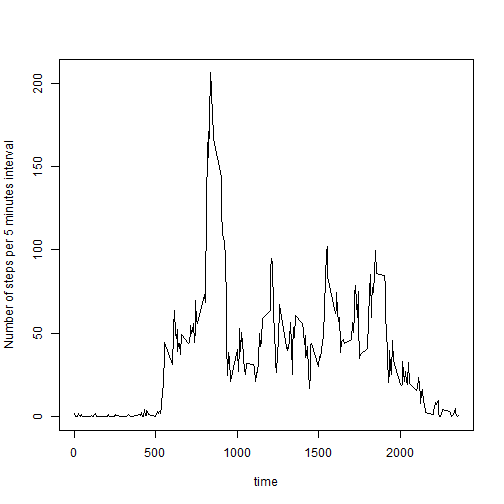
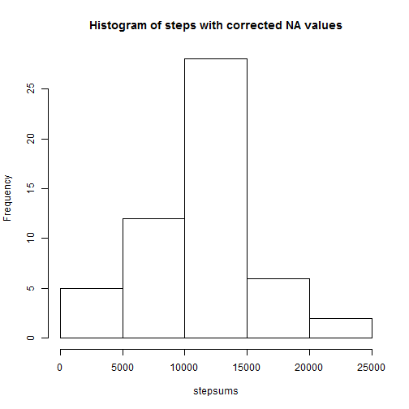
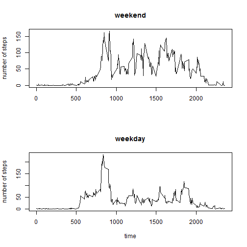

loading needed paclages, and data. coverting date to date format. because it was two months data, cannot use day, since it will duplicate. Therefore use function yday. Adding that column into data.


```r
rm(list=ls())
library(lubridate)
library(plyr)
library(knitr)
#unzip("repdata_data_activity.zip")  # remove front hashtag if current directory only has zipped datafile
acdata<-read.csv("activity.csv", header = TRUE)
date<-as.Date(acdata$date, "%Y-%m-%d")
julday<-yday(date)
acdata$julday<-julday
stepsums<-tapply(acdata$steps, acdata$julday, sum)
```

What is mean total number of steps taken per day

1. Calculating total number of steps per day. Resulting stepsums is an array:


```r
stepsums<-tapply(acdata$steps, acdata$julday, sum)
```

2. Making histogram of total number of steps taken per day:


```r
hist(stepsums)
```

 

3a. Calculating mean value per day (previously calculated to be 10766.1886792453:

```r
meanperday<-mean(stepsums, na.rm = TRUE)
```
3b. Calculating meadian value per day (previously calculated to be 10765:

```r
medianperday<-median(stepsums, na.rm = TRUE)
```


What is the average daily activity patter?

i. averaging number of steps for specific 5 min time interval across different days:


```r
takemeans<-function(x) mean(x, na.rm=TRUE)
stepmeans<-sapply(split(acdata$steps, acdata$interval), takemeans)
```

ii. making a linear plot:

```r
time<-unique(acdata$interval)
plot(time, stepmeans, type="l", ylab = "Number of steps per 5 minutes interval")
```

 

which 5-minute inerval has max number of steps (previous run gave it 835):


```r
interval_with_max_steps<-names(which.max(stepmeans))
```

Reporting and inputing missing values.
1. Total missing values:
  in date column (0 NA's):

```r
missingdates<-sum(is.na(acdata$date))
```
  in time interval column (0 NA's):

```r
missingintervals<-sum(is.na(acdata$interval))
```
  in steps column (2304 NAs):
  

```r
total_missing_steps<-sum(is.na(acdata$steps))
```

2&3. replacing NA's with average value for that interval from stepmeans. new steps variable is called fixxingsteps. 


```r
index<-which(is.na(acdata$steps))
fixxingsteps<-acdata$steps
for (i in index){
  timeinter<-acdata$interval[i]
  fixxingsteps[i]<-stepmeans[which(timeinter==time)]
  }
acdata$fixedsteps<-fixxingsteps
```


4. making histogram, calculating mean and median values with fixed step data:


```r
stepsumsf<-tapply(acdata$fixedsteps, acdata$julday, sum)
hist(stepsums, main="Histogram of steps with corrected NA values")
```

 

```r
meanperdayfixedsteps<-mean(stepsumsf, na.rm = TRUE)
medianperdayfixedsteps<-median(stepsumsf, na.rm = TRUE)
```

After substituting NA's with their corresponding average values for that time itnerval, mean value has not change, median value min change from 10765 to 10766.

weekday-weekend differences:

1. creating weekend and weekday logical variables:

```r
acdata$weekday<-TRUE
acdata$weekday[which(weekdays(date)=="Sunday")]<-FALSE
acdata$weekday[which(weekdays(date)=="Saturday")]<-FALSE
acdata$weekend<-!acdata$weekday
```

2. making panel plot:


```r
stepmeansweekday<-sapply(split(acdata$fixedsteps[acdata$weekday], acdata$interval[acdata$weekday]), takemeans)
stepmeansweekend<-sapply(split(acdata$fixedsteps[acdata$weekend], acdata$interval[acdata$weekend]), takemeans)

par(mfrow=c(2,1))
plot(time, stepmeansweekend, type="l", main = "weekend", ylab = "number of steps", xlab = "")
plot(time, stepmeansweekday, type="l", main = "weekday", ylab = "number of steps")
```

 


